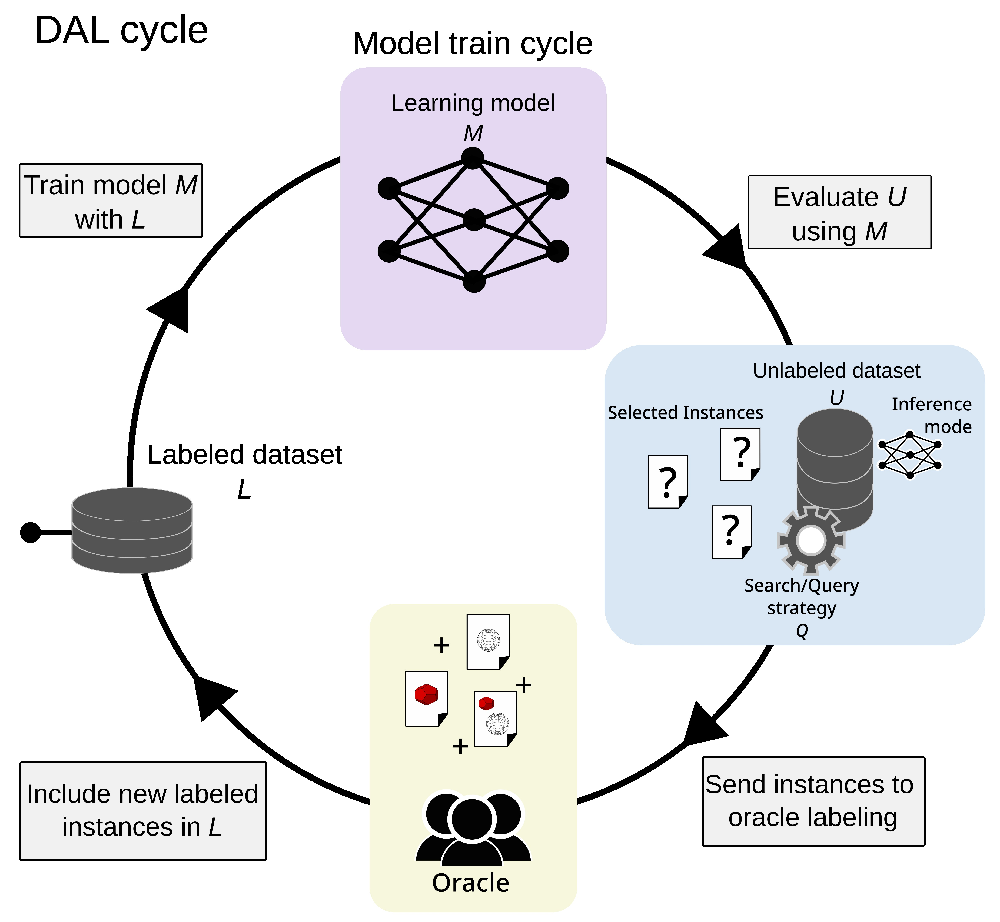

# ProtoAL paper
This repository implements the ProtoAL model presented in the ["ProtoAL: Interpretable deep active learning with prototypes for medical imaging"]('') paper.

<center></center>


- [Directory Structure](#directory-structure)
- [Dataset](#dataset)
- [Generating dataset CSVs](#generating-dataset-csvs) 
- [Environment Configuration](#environment-configuration)
- [Train](#train)
- [Local and Global Analysis](#local-and-global-analysis)
- [Acknowledgment](#acknowledgment)
- [Citation](#citation)

## Directory Structure
- `/dal`: Deep Active Learning O-medal routines;
- `/dataset`: The messidor dataset and other function utilities;
- `/model`: The ProtoPNet model code and model utilities;
- `/runners`: Train, global analysis and local analisys routines;
- `config.ini`: Default parameters config (values used in the paper)
- `config_parser.py`; Config parser;
- `inference.py`: Code to run the local or global analysis;
- `main_al.py`: Main code to run the training routines of the ProtoAL model

## Dataset
The Messidor dataset is available at [messidor download page](https://www.adcis.net/en/third-party/messidor/). Before its use, is necessary to correct the erros listed in the errata section of the page. 

The dataset directory should be informed as argument for `--basedata_dir`. 

## Generating dataset CSVs

The following code excerpt from `main_al.py` is responsable for the load of the dataset. When `load_split = false`, its will generated the csv files and dataframes. Once generated, the `load_split` can be settled to `true`. The csvs files of the paper were generated with the `seed = 1`.

```python 
train_dataframe, val_dataframe, test_dataframe, _, _ = get_dataset(
        config, only_dataframe=True, load_split=False)
    dataframes = {'train': train_dataframe,
                  'val': val_dataframe,
                  'test': test_dataframe}
```

## Environment Configuration
Create a virtual environment using python using ```python -m venv /path/to/new/virtual/environment```
Example:
```sh
python -m venv .venvs/protoal
```

Activate the virtual environvment 

```sh
source .venvs/protoal/bin/activate
```

Install the packages using the ``requiriments.txt`` file

```sh
pip install requiriments.txt
```

## Train
To execute the train routine of the ProtoAL model, execute:

> [!NOTE]
> The traking of the execution is done by using [Weights & Biases](https://wandb.ai/). If you does not have an account, comment the wb calls in the code.

```sh
python main_al.py --dataset messidor --basedata_dir <messidor_dataset_directory>
```
For a complete list of parameters that can be passed, check the ```config_parser.py``` file

At the end of the execution, a CSV log fil will be saved in the ```grid_csv``` directory. The runs iterations, with models savings and pushed prototypes will be saved in the ```saved_models``` directory. 

## Local and Global Analysis

To run the local analysis with an image file, run:

```sh
python inference.py --dataset messidor --infer_mode local --load_model saved_models/<run_dir>/<iter_dir>/model_weights.pth --load_model_dir saved_models/<run_dir>/<iter_dir>/img/ --image_label <label_value> --save_dir_path results/ --image_path <test_image_file> > results/output.log
```

To run the global analysis:
```sh
python inference.py --dataset messidor --infer_mode global --load_model saved_models/<run_dir>/<iter_dir>/model_weights.pth --load_model_dir saved_models/<run_dir>/<iter_dir>/img/
```

## Acknowledgment

This repository contains modified source code from [cfchen-duke/ProtoPNet](https://github.com/cfchen-duke/ProtoPNet "https://github.com/cfchen-duke/ProtoPNet") ([MIT License](https://github.com/cfchen-duke/ProtoPNet/blob/81bf2b70cb60e4f36e25e8be386eb616b7459321/LICENSE "https://github.com/cfchen-duke/ProtoPNet/blob/81bf2b70cb60e4f36e25e8be386eb616b7459321/LICENSE")) by Chaofan Chen, Oscar Li, Chaofan Tao, Alina Jade Barnett, and Cynthia Rudin.

This repository contains modified source code from [adgaudio/O-MedAL](https://github.com/adgaudio/O-MedAL "https://github.com/adgaudio/O-MedAL") ([MIT License](https://github.com/adgaudio/O-MedAL?tab=MIT-1-ov-file#readme "https://github.com/adgaudio/O-MedAL?tab=MIT-1-ov-file#readme")) by Asim Smailagic, Pedro Costa, Alex Gaudio, Kartik Khandelwal, Mostafa Mirshekari, Jonathon Fagert, Devesh Walawalkar, Susu Xu, Adrian Galdran, Pei Zhang, Aurélio Campilho, Hae Young Noh.

## Citation
```bibtex
@article{santos2024protoal,
  title={ProtoAL: Interpretable Deep Active Learning with prototypes for medical imaging},
  author={Santos, Iury B de A and de Carvalho, Andr{\'e} CPLF},
  journal={arXiv preprint arXiv:2404.04736},
  year={2024}
}
```

